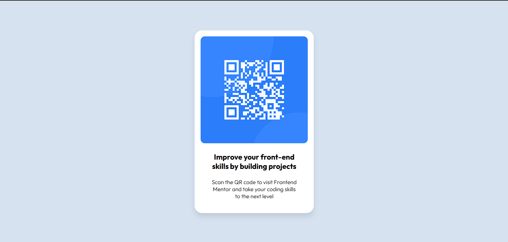

# Componente de QR Code - Desafio do Frontend Mentor

Esta é a minha solução para o desafio [QR Code Component](https://www.frontendmentor.io/challenges/qr-code-component-iux_sIO_H) da plataforma **Frontend Mentor**. O objetivo é praticar habilidades de HTML e CSS criando um componente simples e responsivo com um QR Code.

## 📸 Captura de tela pc e mobile
 *PC*
 

*MOBILE*

## 🔗 Links

- Repositório no GitHub: 
- Página ao vivo: https://qrcodecomponenent.netlify.app/

## 🚀 Tecnologias usadas

- HTML
- CSS
- Flexbox
- Design responsivo (mobile-first)

🔁 Melhorias futuras
Tornar o componente totalmente responsivo em diferentes tamanhos de tela.

Adicionar animações suaves na transição do QR Code.

Criar uma versão escura do layout (dark mode).

📚 Recursos úteis
Guia do Flexbox - CSS Tricks
Guia de cores HSL
Google Fonts

👨‍💻 Autor
GitHub: @Developer-Vini

🙌 Agradecimentos
Projeto realizado com base nos desafios do site Frontend Mentor, que ajudam muito a praticar e evoluir no desenvolvimento front-end.